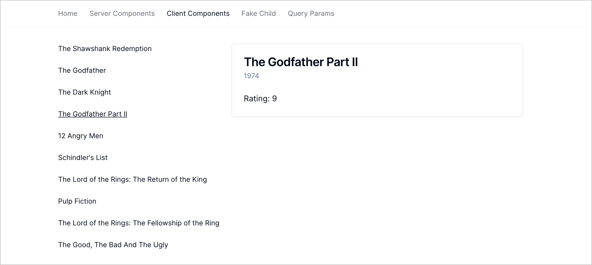

# Next.js 13 Nested Layouts



This is a slightly enhanced version of the
[Nested Layouts demo](https://www.youtube.com/watch?v=6mQ3M1CUGnk) built in
Next.js Conf 2022.

## Development Build

> Note: This app runs against the
> [Movie Magic API](https://github.com/code-shaper/movie-magic) on localhost
> port 8080. Please start that API before following the steps below.

```shell
# Run ci in the root directory to install dependencies
npm ci

# Run the app
npm run dev
```

Now point your browser to http://localhost:3000

### Production Build

```shell
npm run build
npm start
```
