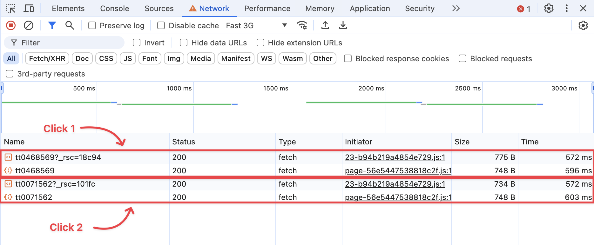

# Next.js Nested Layouts

Live demo: https://nextjs-nested-layouts-ruby.vercel.app/

I created this repo to understand and solve a performance issue when using React
Server Components and Client Components in my specific use case.

## My Use Case

1. Application data is changing frequently – data freshness is important. So
   data caching should be disabled.
2. Data is obtained from an external service that exposes a REST or GraphQL API.
3. FCP, TTI are not important (not a marketing or shopping site).
4. Responsiveness to user interactions is most important.
5. Specifically, we have a master-detail screen. As the user clicks on items in
   the master, we want to show the LATEST detail as soon as possible – the
   application should not feel sluggish.
6. Application is to be used in the field. Assume a Fast 3G connection at best.

Here's a screenshot for the POC – a movie list on the left and the selected
movie's detail on the right. Granted this is not fast changing data, but it will
do for the POC :smiley:


## Implementation Details

I have implemented the requirements 4 ways to compare the performance:

1. **Server Components**: The entire page is built using React Server
   Components. Both master and detail data are fetched on the server.
2. **Client Components**: The entire page is built using React Client
   Components. Both master and detail data are fetched on the client. This is
   the preferred option give the requirements.
3. **Fake Child**: A variation of option 2, to improve performance (not
   successful). Here we are faking the nested child component by returning
   `undefined` (see [here](./src/app/fake-child/%5Bid%5D/page.tsx#L6)). This
   allows us to maintain the URL structure as `/movies/id`, but serve the detail
   as a hard-coded child (see [here](./src/app/fake-child/layout.tsx#L70)).
4. **Query Params**: Abandon the nested layout approach. Use a query parameter
   to get the detail. This approach also did not improve the performance.

Also, to meet the requirements, I have done the following:

1. Server-side fetches use the `no-store` option – see
   [here](./src/app/server-components/layout.tsx#L17).
2. Router Cache has been disabled - see [here](./next.config.js#L5-L9).

## Experience the Performance Issue

Given that Client Components is our preferred option (option 2), let's first
demonstrate the issue.

1. Point your browser to the
   [live demo](https://nextjs-nested-layouts-ruby.vercel.app/), which is the
   production build.
2. Open the Chrome Dev Tools (right click > `Inspect`).
3. Click on the `Network` tab.
4. Change network speed to Fast 3G.
5. In the application, click on the `Client Components` tab. The movie list
   appears on the left. The initial display may be slow because the API server
   may be cold starting, however subsequent loads should be fast.
6. Now start clicking on different movies in the movie list. You will see a
   loading indicator and then the movie detail appearing after ~1200 ms. This is
   the interaction that I am trying to speed up.

## Analysis

Again, this analysis is focused on the Client Components option (option 2).

1. The parent layout is marked as a client component using `'use client'` – see
   [here](./src/app/client-components/layout.tsx#L1).
2. The nested child is also marked as a client component using `'use client'` –
   see [here](./src/app/client-components/%5Bid%5D/page.tsx#L1).

In spite of this entire page consisting of client components only, the browser
is making two network calls on each movie click:

1. Call to the Next.js server to get the RSC Payload
2. Call to the external API to get the movie data

See the Chrome Dev Tools snapshot below for clarity:



The first call to get an RSC Payload seems completely unnecessary for every
click. We are wasting 572 ms per click! Since we are rendering the same client
component repeatedly (just with different data), we should'nt have to download
the RSC payload again and again. I can understand if this Payload is requested
just the first time a movie is clicked.

I would love to get a good explanation of this behavior and a workaround if
possible. All we should see is one call to the API server for each click. What I
am asking for is not unreasonable – it's a no-brainer if I was writing a SPA!

## Development Build

```shell
npm ci
npm run dev
```

Now point your browser to http://localhost:3000

## Production Build

```shell
npm ci
npm run build
npm start
```
